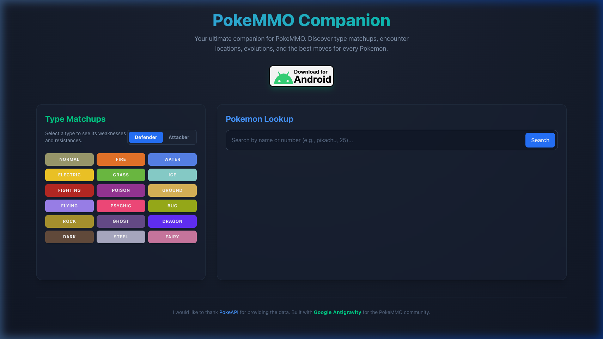
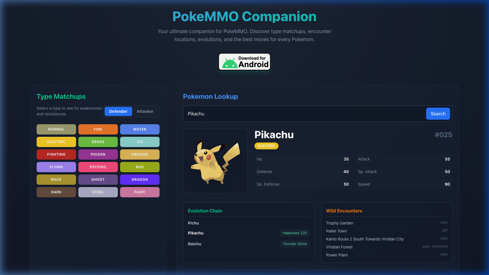

<br />
<div align="center">
  <a href="https://github.com/oshriagronov/pokemmo-guide">
    
  </a>

<h3 align="center">PokeMMO Companion</h3>
  <p align="center">
    Your ultimate companion for PokeMMO. Discover type matchups, encounter locations, evolutions, and the best moves for every Pokemon.
  </p>
</div>

## About

This project showcases an interactive, responsive web application built with React and TailwindCSS to act as the ultimate companion for players of the game PokeMMO. The site fetches data from PokeAPI.
The design of the site utilizes Tailwind CSS.

### Screenshots



## Technologies used

- js, html & css.
- React - Hooks.
- TailwindCSS.

## Tools Utilized
- PokeAPI.
- Antigravity (Google Tool).

## Getting Started

To get a local copy up and running follow these simple steps.

### Prerequisites

- Linux, MacOS or Windows
- nodejs
- npm
- vite

### Installation

---

1. **Clone and enter the pokemmo-guide repository:**

   ```bash
   git clone https://github.com/oshriagronov/pokemmo-guide && cd pokemmo-guide
   ```

2. **Install npm modules::**

   ```bash
   npm i
   ```

3. **Run in dev mode:**  
   ```bash
   npm run dev
   ```

4. **Go to the site:**
<br/> [http://localhost:5173](http://localhost:5173/)

> I used PokeAPI as the data source for the project’s Pokemon information and mechanics. All data corresponds primarily to standard Generation 5 (Black/White) mechanics, which closely mirror PokeMMO.

## Acknowledgements

I would like to thank PokeAPI for providing the data. Built with Google Antigravity for the PokeMMO community.
